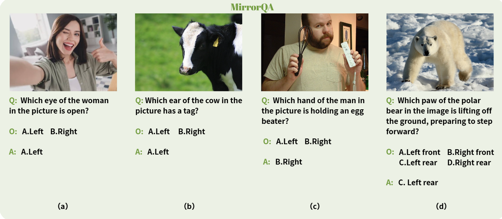
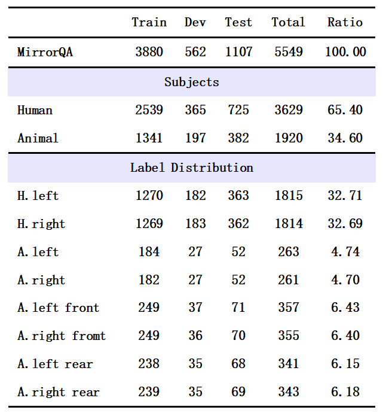
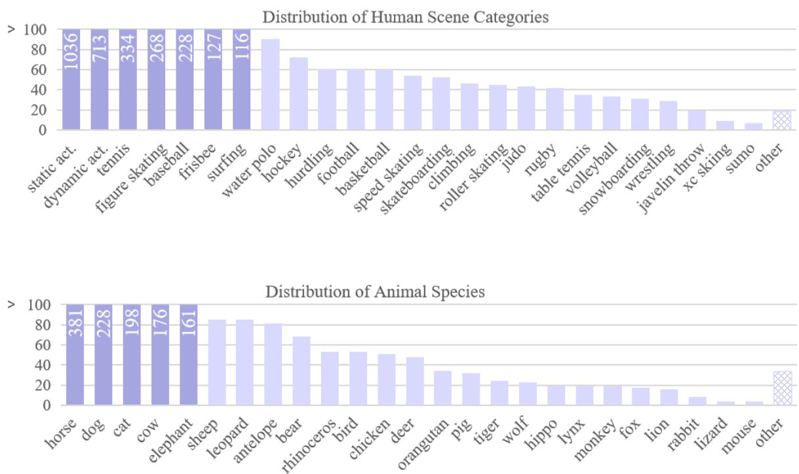

<br />

<p align="center">
  <h1 align="center"> 🪞MirrorQA: Exposing a Fundamental Flaw in How MLLMs Perceive Body-Part Orientation</h1>
  <h3 align="center">MirrorQA: A new benchmark dataset for mirror reasoning of MLLMs.</h3>

  <p align="center">  
    ·
    <a href="https://github.com/stargazer-zeno/MirrorQA">github</a>
    ·
    <a href="https://github.com/stargazer-zeno/MirrorQA/blob/main/LICENSE">license</a>
  </p>
</p>


## Contents

- [MirrorQA](#Contents)
  
  - [Overview](#1-Overview)
    - [Examples](#Examples)
    - [Detail Information](#Detail-Information)
    - [Dataset classification](#Dataset-classification)
  - [Access MirrorQA](#2-Access-MirrorQA)
    - [Download dataset](#Download-dataset)
    - [Data Format](#Data-Format)
  - [Experiment & Evaluation](#3-Experiment-and-Evaluation)
    - [Experiment](#Experiment)
    - [Evaluation](#Evaluation)
    - [Requirements](#Requirements)
  - [License](#4-License)
  
  


## 1 Overview
**MirrorQA** is a **manually annotated** dataset using multiple-choice question & answering (**QA**) to comprehensively evaluate the performance of **multimodal large language models** on the specific task of **orientation-based mirror reasoning**. We extracted 5,549 images from several human and animal datasets, including COCO and Animal-10K, and carefully constructed a body part recognition question for each image. The dataset covers 28 human activities and 43 animal categories. To ensure benchmark quality, we established clear annotation guidelines and a comprehensive quality control process for MirrorQA. This ensures a consistent number of correct answers for the same dimension and avoids questions that can be answered solely based on the model's prior knowledge without images. 

### Examples
The following figures list some classic examples in our dataset. 



###  Detail Information

As reported in the following table, MirrorQA contains 5,549samples, divided into training, validation, and test sets according to a 7:1:2 ratio.And ensure that the number of correct answers of the same type and dimension such as (H.Left and H.Right) is as consistent as possible.
<br>All the splited data sets are in the directory **_(Dataset/jsonl_files)_**. 
<br>

_Due to the fact that only redirecting to the specified file is valid in anonymous links, redirecting to the specified directory is invalid. Therefore, we use bold and italicized font to indicate the markings of all specified directories, making it easier for reviewers to search. Thank you!_

The following table lists the detailed information statistics of the splited dataset.



### Dataset classification

We manually classified the raw data into categories, with human samples categorized by scene and animal samples categorized by species. Human samples were divided into daily life scenes and sports scenes, totaling 28 categories. Daily life scenes included static activities (e.g., standing, sitting) and dynamic activities (e.g., eating, walking), with 1,036 and 713 images, respectively. Sports scenes contained 1,880 images from 26 sports.  Animal samples were organized by species, encompassing 43 animal types. The following chart shows the detailed classification of our dataset.



<br>
You can find our dataset through the following path **_(Dataset/dataset)_** for more details.
<br>

## 2 Access MirrorQA
### Download dataset

Our dataset has been officially released on the Github. It is available at https://github.com/stargazer-zeno/MirrorQA/tree/main/Dataset.  The original images are saved in the **_(Dataset/images)_** directory, and the annotated data are saved in the **_(Dataset/jsonl_files)_** directory


### Data Format
Each `jsonl` file is of the following format:
```json
{"image": "human_eye240.jpg", "question": "Which eye of the man in the picture is closed?", "options": ["A. Left", "B. Right"], "answer": "A"}
{"image": "animal_ear028.jpg", "question": "Which ear of the cow has the tag?", "options": ["A. Left", "B. Right"], "answer": "A"}
{"image": "human_upper_limb0088.jpg", "question": "Which hand is the woman in the picture using to push the stroller?", "options": ["A. Left", "B. Right"], "answer": "A"}
{"image": "leopard09.jpg", "question": "Which paw is the leopard raising in the picture?", "options": ["A. Left front", "B. Right front", "C. Left rear", "D. Right rear"], "answer": "A"}
{"..."}
```
Each line is an individual data point.
`image` denotes name of the image,keep the name consistent with the actual image.`question` is the question with manual annotation, `options` is reasonable combinations of six relative position relationship:(left,right,left front,right front,left rear,right rear). `answer` is the annotation based on the objective world.
<br>


## 3 Experiment and Evaluation

We provide the inference and finetuning code used in our experiments, along with a set of evaluation scripts, organized in the following directory structure.

```bash
Code/
├── close_models/      # Inference code for closed-source models
├── data_process/      # Data process code for additional setting
├── open_models/       # Inference and finetune code for open-source models
├── evaluation/        # Evaluation code for all inference results
└── requirements/      # Environment requirements for running the inference/finetune code
```

### Experiment

#### Data Process

- For circular-eval setting, you can execute Python file **_(Code/data_process/format_circular.py)_** to convert the basic test set into a circular test set. Note that this new set does not include the original (vanilla-eval) order.

```
python format_circular.py
```

#### Inference

- For all 10 open-sourse models, you can directly execute Python files in the directory **_(Code/open_models/inference)_** to perform inference on models before and after fine-tuning: 

```
nohup python intern.py > log/intern.log 2>1& &
...
```

Due to the large amount of open source model code, you need to download it yourself through channels or call it directly from platforms such as [huggingface](https://huggingface.co).
<br>

- For the 2 closed-source models, you can run the Python files in the directory **_(Code/close_models)_** to perform inference ranging from zero-shot to few-shot:

```
nohup python gpt5.py > log/gpt5.log 2>1& &
...
```

#### Finetune

- For instructblip, you can directly execute Python files in the directory **_(Code/open_models/finetune)_** to perform fine-tuning: 

```
nohup python instructblip.py > log/instructblip.log 2>1& &
```

- For the remaining 9 open-source models, you need to execute bash files in the directory **_(Code/open_models/finetune)_** to perform fine-tuning:

```
nohup bash intern.sh > log/intern.log 2>1& &
```

### Evaluation

You can process the results of model inference through the code we provide in the directory **_(Code/evaluation)_** to calculate overall accuracy, overall P, R, F1 indicators, and accuracy based on categories and options for both vanilla and circular setting.

```
python metrics.py
python metrics_circular.py
```

### Requirements

The environment configuration required for inference/finetune code is placed in the directory **_(Code/requirements)_**


## 4 License

This project is licensed under the Apache-2.0 License.
