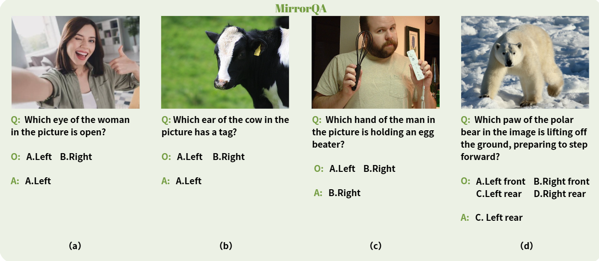
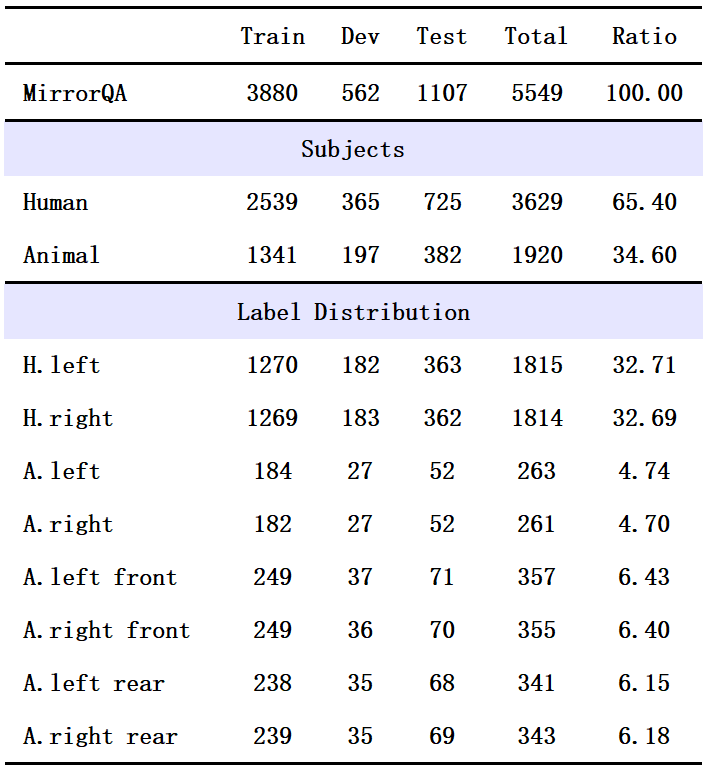
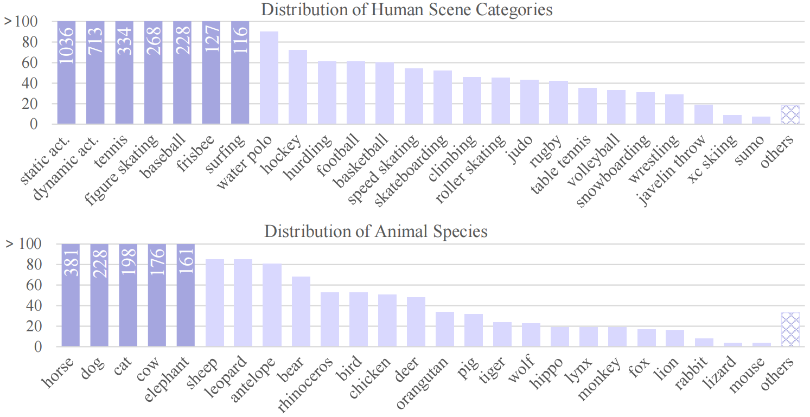

<br />

<p align="center">
  <h1 align="center"> 🪞MirrorQA: Exposing a Fundamental Flaw in MLLM Perception of Body-Part Orientation</h1>
  <h3 align="center">MirrorQA: A new benchmark dataset for mirror reasoning of MLLMs</h3>

  <p align="center">  
    ·
    <a href="https://anonymous.4open.science/r/Anonymous-AC8E/">github</a>
    ·
    <a href="https://anonymous.4open.science/r/Anonymous-AC8E/LICENSE">license</a>
  </p>
</p>


## Contents

- [Contents](#contents)
- [1 Overview](#1-overview)
  
  - [Examples](#examples)
  - [Detail Information](#detail-information)
  - [Dataset classification](#dataset-classification)
- [2 Access MirrorQA](#2-access-mirrorqa)
  
  - [Download dataset](#download-dataset)
  - [Data Format](#data-format)
- [3 Experiment and Evaluation](#3-experiment-and-evaluation)
  
  - [Experiment](#experiment)
    - [Data Process](#data-process)
    - [Inference](#inference)
    - [Finetune](#finetune)
  - [Evaluation](#evaluation)
  - [Requirements](#requirements)
- [4 License](#4-license)
  
  


## 1 Overview
**MirrorQA** is a **manually annotated** dataset using multiple-choice question & answering (**QA**) to comprehensively evaluate the performance of **multimodal large language models(MLLMs)** on the specific task of **mirror-based orientation reasoning**. We extracted 5,549 images from several human and animal datasets(e.g., COCO, Animal-10K,etc)  and carefully constructed a body part recognition question for each image. The dataset covers 28 human activities and 43 animal categories. To ensure benchmark quality, we established clear annotation guidelines and a comprehensive quality control process for MirrorQA. These measures ensures a balanced distribution of correct answers across different dimensions and eliminates questions that can be answered using only the model's prior knowledge, without relying on the image.

### Examples
The following figures list some classic examples in our dataset. 



###  Detail Information

As detailed in the following table, MirrorQA contains 5,549 samples, split into training, validation, and test sets with a 7:1:2 ratio.We also ensured that the number of correct answers for symmetrical types and dimensions (e.g., H.Left and H.Right) is as balanced as possible.
<br>All the split data sets are in the directory **_(Dataset/vqa_files)_**. 
<br>

_Note: To make directory paths easier to find, they are formatted in **bold and italics**. This is because direct links to directories may not work in some environments. Thank you!_

The following table lists the detailed information statistics of the splited dataset.



### Dataset classification

We manually classified the raw data into categories, with human samples categorized by scene and animal samples categorized by species. Human samples were divided into daily life scenes and sports scenes, totaling 28 categories. Daily life scenes included static activities (e.g., standing, sitting) and dynamic activities (e.g., eating, walking), with 1,036 and 713 images, respectively. Sports scenes contained 1,880 images from 26 sports.  Animal samples were organized by species, encompassing 43 species. The following chart shows the detailed classification of our dataset.




## 2 Access MirrorQA
### Download dataset

Our dataset has been officially released on the Github. It is available at [MirrorQA](https://anonymous.4open.science/r/Anonymous-AC8E/).  The original images are saved in the **_(Dataset/images)_** directory, and the annotated data are saved in the **_(Dataset/vqa_files)_** directory.


### Data Format
Each `JSONL` file is of the following format:
```json
{"image": "human_eye240.jpg", "question": "Which eye of the man in the picture is closed?", "options": ["A. Left", "B. Right"], "answer": "A"}
{"image": "animal_ear028.jpg", "question": "Which ear of the cow has the tag?", "options": ["A. Left", "B. Right"], "answer": "A"}
{"image": "human_upper_limb0088.jpg", "question": "Which hand is the woman in the picture using to push the stroller?", "options": ["A. Left", "B. Right"], "answer": "A"}
{"image": "leopard09.jpg", "question": "Which paw is the leopard raising in the picture?", "options": ["A. Left front", "B. Right front", "C. Left rear", "D. Right rear"], "answer": "A"}
{"..."}
```
Each line is an individual data point.The meaning of each field is as follows:

- `image`: The filename of the image, which should be consistent with the actual file.

- `question` : The manually annotated question.

-  `options` : A set of reasonable choices based on six relative positions: (left, right, left front, right front, left rear, right rear).

-  `answer` : The correct answer based on the objective world.

  <br>

## 3 Experiment and Evaluation

We provide the inference and fine-tuning code used in our experiments, along with a set of evaluation scripts, organized in the following directory structure.

```bash
Code/
├── close_models/      # Inference code for closed-source models
├── data_process/      # Data process code for additional setting
├── open_models/       # Inference and finetune code for open-source models
├── evaluation/        # Evaluation code for all inference results
└── requirements/      # Environment requirements for running the inference/finetune code
```

### Experiment

#### Data Process

- For circular-eval setting, you can execute Python file **_(Code/data_process/format_circular.py)_** to convert the basic test set into a circular test set. Note that this new set does not include the original (vanilla-eval) order.

```
python format_circular.py
```

#### Inference

- For all 10 open-source models, you can directly execute Python files in the directory **_(Code/open_models/inference)_** to perform inference on models before and after fine-tuning: 

```
nohup python intern.py > log/intern.log 2>1& &
...
```

Due to their size, the open-source model weights are not included. You will need to download them manually or load them directly from platforms like  [Hugging Face](https://huggingface.co).
<br>

- For the 2 closed-source models, you can run the Python files in the directory **_(Code/close_models)_** to perform inference ranging from zero-shot to few-shot:

```
nohup python gpt5.py > log/gpt5.log 2>1& &
...
```

#### Finetune

- For instructBLIP, you can directly execute Python files in the directory **_(Code/open_models/finetune)_** to perform fine-tuning: 

```
nohup python instructblip.py > log/instructblip.log 2>1& &
```

- For the remaining 9 open-source models, you need to execute bash files in the directory **_(Code/open_models/finetune)_** to perform fine-tuning:

```
nohup bash intern.sh > log/intern.log 2>1& &
```

### Evaluation

You can process the results of model inference through the code we provide in the directory **_(Code/evaluation)_** to calculate overall accuracy, Precision (P), Recall (R), and F1 scores, and accuracy based on categories and options for both vanilla and circular setting.

```
python metrics.py
python metrics_circular.py
```

### Requirements

The environment configuration required for inference/finetune code is placed in the directory **_(Code/requirements)_**.


## 4 License

This project is licensed under the Apache-2.0 License.
